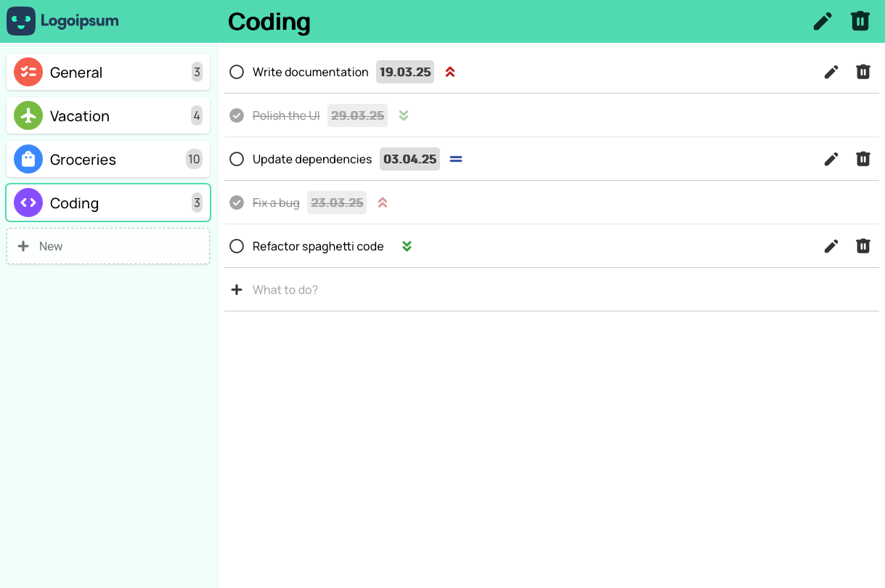

# ToDo List

<p align="center">
  
  <a href="https://github.com/insomniac2305/todo/graphs/commit-activity" target="_blank"></a>
  
  <a href="https://github.com/insomniac2305/todo/blob/main/LICENSE" target="_blank"></a>
</p>

## Overview

A ToDo list is the classic first application to build when getting started with software development. This one features an interactive UI that allows users to create, edit, and delete tasks separated into projects, with all data persistently stored in local storage.

Originally built as part of [The Odin Project's curriculum](https://www.theodinproject.com/) to practice developing an interactive web app with plain HTML, CSS, and JavaScript, it was later converted to TypeScript for learning purposes.

<p align="center">
  
</p>

## Features

- ✅ **Task Management** – Add, update, and remove tasks with due dates and priority levels
- 🗂️ **Project Organization** – Create, edit, and delete projects with customizable icons and colors.
- 💾 **Persistent Storage** – Saves projects and tasks in local storage.

## Icons

This project uses [Material Symbols Rounded](https://fonts.google.com/icons) by Google Fonts. When choosing an icon for a project, refer to the icon list at the aforementioned link and enter the corresponding icon name into the text field.

## Technologies Used

- HTML, CSS
- TypeScript
- Webpack
- LocalStorage

## Setup Instructions

1. Clone the repository:

   ```sh
   git clone https://github.com/insomniac2305/todo.git
   cd todo
   ```

2. Install dependencies:

   ```sh
   npm install
   ```

3. Run the development server:

   ```sh
   npm start
   ```

The application will be available at `http://localhost:8080/` in your browser when running the development server.

## Build & Deployment

1. To create an optimized build for production, run:
   ```sh
   npm run build
   ```
2. This project is configured for deployment via GitHub Pages:
   ```sh
   npm run deploy
   ```

## License

This project is [GPL-3.0](https://github.com/insomniac2305/todo/blob/main/LICENSE) licensed.
